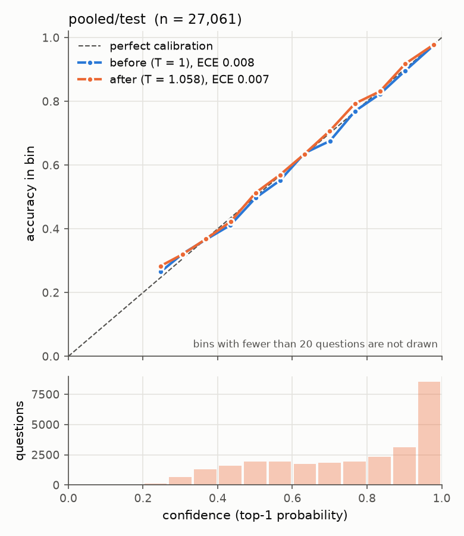
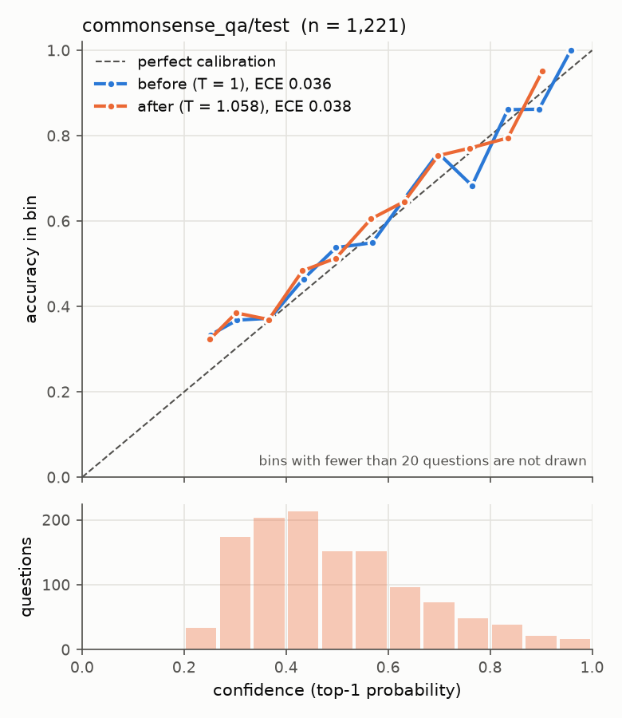
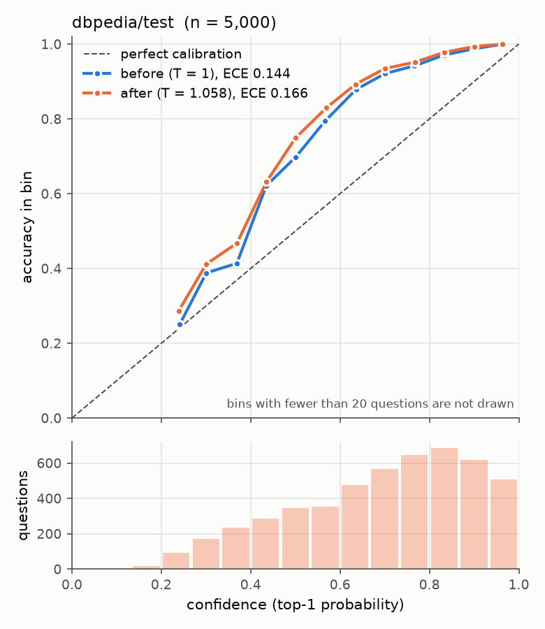

# trueodds

[](https://github.com/hericlesferraz/trueodds/actions/workflows/ci.yml)

A small decision model that answers multiple-choice questions about a piece of text with a
probability for each option, from one forward pass, and measures whether those probabilities are
true.

Given a **state** (any text), a **question** and a list of **options**, it returns
`{option: probability}`. It never generates text. The design follows the idea behind "System One"
decision models such as TypeSafe AI's Jev, rebuilt small, from public datasets, on one consumer
GPU, to understand how such a model works and where it fails.

trueodds is not affiliated with or endorsed by TypeSafe AI.

Three things are measured, by a harness that existed before the first model was trained:

- **Accuracy** on the test split of every training dataset.
- **Generalization:** accuracy on five datasets the model never saw (CommonsenseQA, DBpedia-14,
  RTE, WiC, Rotten Tomatoes) and on question phrasings it never saw, against random,
  majority-class and label-frequency baselines.
- **Calibration:** expected calibration error (ECE), negative log-likelihood and Brier score,
  before and after temperature scaling, on the training datasets and on the unseen ones.

This is a learning project, not a new method.

**The main finding:** on data like its training data the model's probabilities are true (pooled
ECE 0.007: answers given 0.8 are right about 80% of the time). On data unlike it they are not, and
the error changes direction with the kind of novelty: overconfident on tasks it was never trained
for, underconfident on label sets it never saw. Accuracy carries over where the skill exists;
calibration does not.

## Status

**Done (2026-09-25).** v1 is ModernBERT-base fine-tuned for one epoch on eight public datasets,
with one temperature fitted on the dev split (Phases 0–4). Phase 5 measured five experiments
against it: ModernBERT-large, shared state encoding, latency on the CPU, three farther held-out
datasets, and what makes unseen labels underconfident; all are below. See
[`docs/PLAN.md`](docs/PLAN.md) for the phases and exit criteria,
[`docs/ARCHITECTURE.md`](docs/ARCHITECTURE.md) for the design, and
[`docs/DECISIONS.md`](docs/DECISIONS.md) (D1–D33) for why things are the way they are.

## Usage

```python
import trueodds

model = trueodds.load()   # ~/.trueodds/runs/phase2-templates/best and its temperature
state = "The striker scored twice in the second half to seal the title."

model.predict(state, "What is this text about?",
              ["World", "Sports", "Business", "Science and technology"])
# {'World': 0.049, 'Sports': 0.948, 'Business': 0.002, 'Science and technology': 0.0}

model.predict_batch(state, [
    ("Is this a news report?", ["yes", "no"]),
    ("Does it follow that a team won a championship?", ["yes", "maybe", "no"]),
])
# [{'yes': 0.842, 'no': 0.158}, {'yes': 0.696, 'maybe': 0.3, 'no': 0.005}]
```

The contract (errors, truncation, the batch form) is in [`specs/003-predict.md`](specs/003-predict.md).
## Reproducing

**No trained weights are published** (several datasets are share-alike, non-commercial or have no
stated license; see [`docs/LICENSES.md`](docs/LICENSES.md)). They are rebuilt from public data on
one 16 GB GPU; `docs/SETUP.md` has the verified install steps and measurements.

```bash
uv sync                                                    # Python 3.12, PyTorch with CUDA 12.8
uv run python scripts/prepare_data.py                      # ~1 GB download, to ~/.trueodds/data
uv run --extra gpu python -m trueodds.train configs/phase2-templates.yaml   # v1, ~4 h on an RTX 5060 Ti
uv run --extra gpu python -m harness.calibrate --checkpoint ~/.trueodds/runs/phase2-templates/best
uv run pytest                                              # unit tests, CPU only
```

`configs/phase5-large.yaml` (~9 h) and `configs/phase5-shared.yaml` (~1 h) rebuild the Phase 5
models; set `PYTORCH_CUDA_ALLOC_CONF=expandable_segments:True` for them (SETUP.md).

## Results

Test split of every training dataset, and the two datasets never trained on. The best baseline is
the higher of random and majority class; the prior baseline knows the label frequencies and reads
no text (D18). NLL is at the fitted temperature, which is what `predict()` returns. From
[`2026-09-24-110652-calibration.json`](harness/results/2026-09-24-110652-calibration.json).

| dataset | n | accuracy | best baseline | NLL (prior) | ECE, T = 1 | ECE, T = 1.058 |
|---|---|---|---|---|---|---|
| BoolQ | 3,270 | 0.806 | 0.622 | 0.427 (0.663) | 0.037 | 0.028 |
| MNLI | 5,000 | 0.859 | 0.333 | 0.379 (1.099) | 0.008 | 0.013 |
| ARC-Easy | 2,376 | 0.595 | 0.250 | 0.999 (1.388) | 0.044 | 0.057 |
| ARC-Challenge | 1,172 | 0.456 | 0.265 | 1.230 (1.384) | 0.058 | 0.049 |
| HellaSwag | 3,243 | 0.592 | 0.250 | 0.975 (1.387) | 0.032 | 0.028 |
| MMLU auxiliary | 2,000 | 0.702 | 0.272 | 0.749 (1.384) | 0.021 | 0.016 |
| AG News | 5,000 | 0.934 | 0.250 | 0.192 (1.386) | 0.008 | 0.012 |
| Yahoo Answers | 5,000 | 0.744 | 0.100 | 0.779 (2.303) | 0.016 | 0.019 |
| **Pooled test** | 27,061 | **0.761** | 0.282 | 0.614 (1.415) | 0.008 | 0.007 |
| CommonsenseQA *(held out)* | 1,221 | 0.530 | 0.210 | 1.199 (1.605) | 0.036 | 0.038 |
| DBpedia-14 *(held out)* | 5,000 | 0.861 | 0.072 | 0.569 (2.639) | 0.144 | 0.166 |

What the table says:

- Accuracy is far above the baselines everywhere, including the two datasets never seen in
  training, and NLL is below the prior's everywhere.
- In-domain the model was already calibrated before temperature scaling (pooled ECE 0.008); the
  fitted T = 1.058 changes it only within noise (95% interval −0.005 to +0.005).
- **Calibration does not transfer to unseen label sets.** On DBpedia-14 the model is
  underconfident (answers given 0.5 are right about 70% of the time), and the temperature fitted
  on seen data makes it worse. The probabilities are trustworthy on data like the training data,
  and not yet beyond it (D27).
- Accuracy on a question phrasing never trained on is within 1.4 points of the trained phrasings
  on every templated dataset (D8, D26).

Reliability diagrams (confidence against observed accuracy, before and after the temperature):

| Pooled test | CommonsenseQA (held out) | DBpedia-14 (held out) |
|---|---|---|
|  |  |  |

### Latency

`predict()` end to end (tokenization, forward pass, softmax) on an RTX 5060 Ti, bf16, after warmup,
200 requests per cell, from
[`2026-09-24-122853-latency.json`](harness/results/2026-09-24-122853-latency.json):

| options | state 64 tokens | 256 tokens | 480 tokens |
|---|---|---|---|
| 2 | 13.7 ms (p95 14.6) | 13.8 ms (14.6) | 16.5 ms (17.4) |
| 4 | 14.1 ms (15.0) | **17.7 ms (18.8)** | 26.9 ms (28.1) |
| 14 | 16.9 ms (17.8) | 45.8 ms (47.3) | 98.2 ms (99.9) |

Many questions about one 256-token state (options K = 2 to 14): 50 questions take 1.31 s with
`predict_batch` and 1.27 s one by one. Batching saves nothing. Each option is its own sequence
that repeats the state, so one question already carries enough tokens to keep the GPU busy, and a
batch only removes per-call overhead that was already hidden behind the compute. Encoding the
state once is the Phase 5 shared-state experiment (D13).

**On the CPU** (Ryzen 7 5700X, 8 threads, fp32, nothing optimized;
[`2026-09-25-015515-latency.json`](harness/results/2026-09-25-015515-latency.json)):

| options | state 64 tokens | 256 tokens | 480 tokens |
|---|---|---|---|
| 2 | 71 ms | 208 ms | 492 ms |
| 4 | 118 ms | **517 ms** | 1.01 s |
| 14 | 420 ms | 2.09 s | 4.00 s |

5 to 46 times the GPU. The CPU has no overhead floor to hide behind, so the time follows the
number of options times the state length. `predict_batch` is slower than one by one here (50
questions: 66 s against 54 s).

### Experiment: ModernBERT-large (Phase 5A)

The same training with ModernBERT-large (~395M parameters) instead of base, compared question by
question with v1, each at its own fitted temperature, with paired bootstrap 95% intervals
([`2026-09-25-015315-compare.json`](harness/results/2026-09-25-015315-compare.json), D29):

| dataset | accuracy base → large | Δ (95% interval) | ECE base → large |
|---|---|---|---|
| BoolQ | 0.806 → 0.860 | +5.4 (+4.3, +6.7) | 0.028 → 0.021 |
| MNLI | 0.859 → 0.894 | +3.5 (+2.7, +4.3) | 0.013 → 0.020 |
| ARC-Easy | 0.595 → 0.721 | +12.6 (+10.4, +14.8) | 0.057 → 0.041 |
| ARC-Challenge | 0.456 → 0.599 | +14.3 (+11.2, +17.5) | 0.049 → 0.037 |
| HellaSwag | 0.592 → 0.710 | +11.7 (+10.1, +13.5) | 0.028 → 0.044 |
| MMLU auxiliary | 0.702 → 0.797 | +9.5 (+7.7, +11.3) | 0.016 → 0.025 |
| AG News | 0.934 → 0.935 | +0.1 (−0.3, +0.5) | 0.012 → 0.011 |
| Yahoo Answers | 0.744 → 0.760 | +1.5 (+0.8, +2.3) | 0.019 → 0.030 |
| **Pooled test** | **0.761 → 0.815** | **+5.4 (+5.0, +5.9)** | 0.007 → 0.011 |
| CommonsenseQA *(held out)* | 0.530 → 0.639 | +10.9 (+7.9, +13.8) | 0.038 → 0.025 |
| DBpedia-14 *(held out)* | 0.861 → 0.843 | −1.7 (−2.8, −0.7) | 0.166 → 0.203 |

Large reads better: the gain is largest where the answer takes reasoning over the text (ARC,
HellaSwag, MMLU) and on CommonsenseQA, never trained on. It is not better calibrated, and on
DBpedia-14, the unseen label set, it is less accurate and more underconfident than base. It also
takes about twice as long (K = 4, 256-token state: 37.4 ms p50 against 17.7), so v1 stays the
default model.

### Experiment: shared state encoding (Phase 5B)

The v1 model reads the state once per option. The shared-state variant reads it once, then every
question and option in the same sequence, with attention masks that keep questions and options
apart ([spec 004](specs/004-shared-state.md), D13). Compared with v1 the same way as -large
([`2026-09-25-041921-compare.json`](harness/results/2026-09-25-041921-compare.json), D30):

| | v1 | shared state |
|---|---|---|
| Pooled test accuracy | 0.761 | 0.747 (−1.3, interval −1.8 to −0.9) |
| Pooled ECE at T | 0.007 | 0.010 (same within noise) |
| CommonsenseQA / DBpedia-14 accuracy | 0.530 / 0.861 | 0.483 / 0.822 |
| 1 question, 4 options, 256-token state (GPU / CPU) | 17.7 ms / 517 ms | 14.3 ms / 120 ms |
| 50 questions about one state (GPU / CPU) | 1,270 ms / 53.7 s one by one | **44 ms / 1.54 s** batched |
| Training time, 2 epochs | 246 min | 57 min |

The state never sees the question, and that costs 1.3 points: more where the answer depends on
reading the state for that question (ARC-Easy −4.0, HellaSwag −3.4), nothing on classifying a
document (AG News, Yahoo, BoolQ). Calibration is unchanged. In return, 50 questions about one
state take 44 ms instead of 1.27 s, which is what the Jev-style use (one state, many questions)
needs. v1 stays the default; `trueodds.load("~/.trueodds/runs/phase5-shared/best")` loads the
shared model with the same `predict` and `predict_batch`.

### Experiment: farther from the training data (Phase 5D, 5E)

Three more datasets never trained on, of kinds the first two held-out sets did not cover (D31):
RTE (2-way inference), WiC (does a word mean the same in two sentences, a task never trained) and
Rotten Tomatoes (sentiment, a label set never trained). At each model's fitted temperature;
"conf − acc" above 0 is overconfident:

| dataset | v1 accuracy | conf − acc | -large accuracy | conf − acc | shared accuracy | conf − acc |
|---|---|---|---|---|---|---|
| RTE (2,767) | 0.729 | +0.155 | 0.771 | +0.127 | 0.759 | +0.110 |
| WiC (5,000; chance 0.5) | 0.475 | +0.151 | 0.565 | +0.032 | 0.504 | +0.193 |
| Rotten Tomatoes (5,000) | 0.826 | −0.137 | 0.882 | −0.172 | 0.808 | +0.015 |

**Accuracy carries over where the skill exists; the probabilities do not.** In training data the
confidence matches the accuracy to within 1%; here it is off by more than 10 points in 7 of the 9
cells, and on the new tasks it is *over*confident: on WiC, v1 is below chance at an average confidence of 0.63. A
temperature fitted on seen data cannot fix this, because the error changes sign with the kind of
novelty.

**Why unseen labels are underconfident** (5E, D32): each question scored again with its answer
and a few random other options. At 4 options, DBpedia-14 (unseen labels) is still underconfident
by 0.06–0.08 while Yahoo and AG News (trained labels) are within 0.015, and DBpedia-14's gap grows
with the number of options (−0.02 at 2, −0.17 at 14 for v1). The cause is the new labels; the
number of options sets how large it gets.

## Datasets

Downloaded from the Hugging Face Hub by a script and never stored in this repository. Each one keeps
its own license. The licenses below are the Hub's tags as of 2026-09-23; each is checked against its
original source in Phase 0.

**Training**

| Dataset | Hub ID | Task | Rows (all splits) | License (Hub tag) |
|---|---|---|---|---|
| BoolQ | `google/boolq` | yes/no about a passage | 12.7k | CC-BY-SA 3.0 |
| MNLI | `nyu-mll/glue`, config `mnli` | yes / maybe / no | 432k | other (GLUE defers to MultiNLI's terms) |
| ARC-Easy, ARC-Challenge | `allenai/ai2_arc` | science multiple choice | 5.2k + 2.6k | CC-BY-SA 4.0 |
| HellaSwag | `Rowan/hellaswag` | choose the ending | 60k | none on the Hub |
| MMLU auxiliary train | `cais/mmlu`, config `auxiliary_train` | multiple choice | 100k | MIT |
| AG News | `fancyzhx/ag_news` | 4 topics | 128k | unknown |
| Yahoo Answers Topics | `community-datasets/yahoo_answers_topics` | 10 topics | 1.46M | unknown |

**Held out, never trained on**

| Dataset | Hub ID | Task | Rows (all splits) | License (Hub tag) |
|---|---|---|---|---|
| CommonsenseQA | `tau/commonsense_qa` | 5-option commonsense | 12.1k | MIT |
| DBpedia-14 | `fancyzhx/dbpedia_14` | 14 topics | 630k | CC-BY-SA 3.0 |
| RTE | `nyu-mll/glue`, config `rte` | 2-way inference (yes / no) | 5.8k | other (from the PASCAL RTE challenges) |
| WiC | `aps/super_glue`, config `wic` | same word sense? (yes / no) | 7.5k | CC BY-NC 4.0 (WiC's site) |
| Rotten Tomatoes | `cornell-movie-review-data/rotten_tomatoes` | sentiment | 10.7k | none stated |

Only labeled splits are used: 2,767 RTE questions and 5,000 each from WiC and Rotten Tomatoes
(Phase 5D). Together the datasets are about 1 GB of parquet to download.

## Backbone

[ModernBERT-base](https://huggingface.co/answerdotai/ModernBERT-base) (Answer.AI and LightOn,
Apache-2.0); [ModernBERT-large](https://huggingface.co/answerdotai/ModernBERT-large) for the
Phase 5 comparison.

## License

The code is under the [Apache License 2.0](LICENSE). The datasets are not part of the repository
and keep their own licenses ([`docs/LICENSES.md`](docs/LICENSES.md)); the results JSONs hold
counts and metrics, not dataset text.
